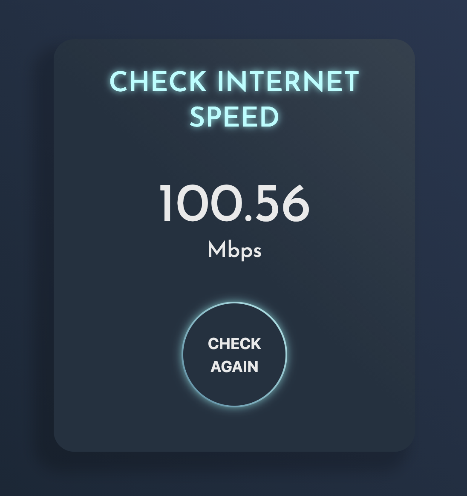

# Bandwidth test

A simple web-based tool to test your internet download bandwidth. Built with vanilla JavaScript and styled with CSS.

## Features

 
- Clean and modern UI with gradient effects
- Real-time speed testing visualization
- Results displayed in Mbps
- Mobile-responsive design

## How It Works

1. The speed test works by downloading a sample image file (8.18 MB)
2. Measures the time taken to download
3. Calculates speed using the formula: (file size * 8) / time in seconds
4. Displays the result with an animated counter

## Usage

Simply open [index.html](index.html) in a web browser and click the "CHECK" button to start the speed test. The test will:

1. Show a loading animation while testing
2. Calculate your current download speed
3. Display the result in Mbps
4. Allow you to test again with the "CHECK AGAIN" button

## Files

- [index.html](index.html) - Main HTML structure
- [style.css](style.css) - Styling with gradients and animations
- [script.js](script.js) - Speed test logic implementation

## License

This project is licensed under the Apache License 2.0 - see the [LICENSE](LICENSE) file for details.